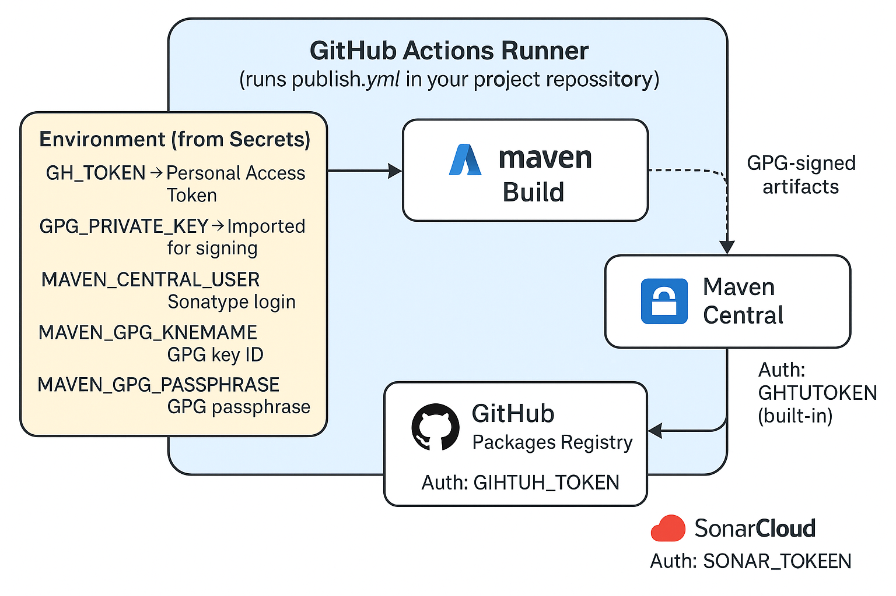

# 📦 modern-java-parent

A reusable **Maven Parent POM** for building modern Java libraries — powered by **Java 17**, **JUnit 5**, **Lombok**, **Log4j2**, **Sonatype Central Publishing**, and **GitHub Actions CI/CD**.

This project provides a **clean, opinionated build baseline** that includes:
- ✅ Standardized compiler and annotation processing
- ✅ JUnit 5, Mockito, AssertJ, JaCoCo, and SonarQube for quality
- ✅ SLF4J + Log4j2 logging
- ✅ Jackson, Guava, Apache Commons, RxJava3, Resilience4j, Vavr
- ✅ Source + Javadoc JAR generation
- ✅ Automatic GPG signing and checksum generation
- ✅ Seamless publication to **Maven Central**

## 🧭 Overview

**GroupId:**    `io.github.venkateshamurthy`  
**ArtifactId:** `modern-java-parent`  
**Version:**     `1.0.0`  
**Packaging:**  `pom`

This parent POM standardizes build configuration across all your projects — so you can focus on writing clean code
, not repeating build boilerplate. However please note the dependencies will still eed to be declared but without any
version/configuration.

## ⚙️ Features

| Feature                                      | Description |
|----------------------------------------------|-------------|
| ☕ **Java 17+**                               | Uses `<release>17</release>` for compiler consistency |
| 🧩 **Lombok-ready**                          | Configured annotation processor for Lombok |
| 🧪 **JUnit 5 + Mockio + AssertJ + Surefire** | Modern testing platform |
| 🧮 **JaCoCo + SonarQube**                    | Code coverage and quality metrics |
| 🪶 **Lightweight Logging**                   | SLF4J API backed by Log4j2 |
| 🧰 **Utility Stack**                         | Jackson, Apache Commons, RxJava3, Vavr, Resilience4j |
| 🔐 **GPG Signing**                           | Secure artifact signing for Maven Central |
| 🪣 **Auto-publishing**                       | Built-in Sonatype Central Publishing support |
| ⚙️ **GitHub Actions CI/CD**                  | Ready-to-run workflow for tests and deployment |

## 🧱 Usage — Inherit in Your Project

To use this parent POM, simply declare it in your child project’s `pom.xml`:

```xml
<parent>
  <groupId>io.github.venkateshamurthy</groupId>
  <artifactId>modern-java-parent</artifactId>
  <version>1.0.0</version>
</parent>

<artifactId>dynamic-enum</artifactId>
<name>Dynamic Enum Library</name>
<description>Runtime-extensible enums for Java.</description>
<!-- 
   Dependencies; still need to be added as parent pom only defines it in <dependencyManagement> section 
   They are to be re declared in client only with groupId and artifactId but without any version and other configurations
 -->
<dependencies>
  <!-- Logging -->
  <dependency><groupId>org.slf4j</groupId><artifactId>slf4j-api</artifactId></dependency>
  <dependency><groupId>org.apache.logging.log4j</groupId><artifactId>log4j-slf4j2-impl</artifactId></dependency>
  <!-- JSON binding -->
  <dependency><groupId>com.fasterxml.jackson.core</groupId><artifactId>jackson-databind</artifactId></dependency>
  <!-- Unit testing -->
  <dependency><groupId>org.junit.jupiter</groupId><artifactId>junit-jupiter</artifactId></dependency>
</dependencies>
```

Now you can build and deploy without repeating plugin configuration.

## 🚀 Deployment to Sonatype Central

This parent comes preconfigured for the [Sonatype Central Publishing Portal](https://central.sonatype.com/).  
No need for `<distributionManagement>` or manual staging — just ensure your environment is set up with the following:

### 🔐 `~/.m2/settings.xml`

```xml
<settings>
  <servers>
    <server>
      <id>central</id>
      <username>${env.MAVEN_CENTRAL_USER}</username>
      <password>${env.MAVEN_CENTRAL_TOKEN}</password>
    </server>
  </servers>
</settings>
```

### 🧩 GitHub and Central Maven Secrets

| Secret                     | Purpose                                |
| -------------------------- | -------------------------------------- |
| `GH_TOKEN`                 | Personal Access Token (write:packages) |
| `GPG_PRIVATE_KEY`          | Exported private key block             |
| `MAVEN_CENTRAL_USER`       | Sonatype username                      |
| `MAVEN_CENTRAL_TOKEN`      | Sonatype API token                     |
| `MAVEN_GPG_KEYNAME`        | Long GPG key ID                        |
| `MAVEN_GPG_PASSPHRASE`     | GPG passphrase                         |
| `SONAR_ORG` *(optional)*   | SonarCloud organization key            |
| `SONAR_TOKEN` *(optional)* | SonarCloud token                       |


Once configured, simply tag a release:

```bash
git tag -a v1.0.0 -m "Release 1.0.0"
git push origin v1.0.0
```

GitHub Actions will build, test, sign, and publish your artifact to Central automatically.

## 🧪 Running Tests Locally

```bash
mvn clean verify
```

This runs:
- Unit tests via JUnit 5
- Coverage via JaCoCo (`target/site/jacoco/index.html`)
- GPG signing and checksum generation (verify phase)
- Other maven targets can be added (such as site, deploy) as per the need. Please note that the deploy 

## 🧠 Key Plugins Configured

| Plugin | Purpose |
|---------|----------|
| `maven-compiler-plugin` | Java 17 + Lombok annotation processing |
| `maven-surefire-plugin` | JUnit 5 test execution |
| `jacoco-maven-plugin` | Code coverage reports |
| `maven-source-plugin` | Sources JAR generation |
| `maven-javadoc-plugin` | Javadoc JAR generation |
| `maven-gpg-plugin` | GPG artifact signing (loopback mode for CI) |
| `central-publishing-maven-plugin` | Auto-deploy to Sonatype Central |
| `sonar-maven-plugin` | SonarCloud analysis integration |


## 🧰 Tech Stack

| Area | Libraries |
|-------|------------|
| Logging | SLF4J, Log4j2 |
| Utilities | Apache Commons Lang3, Collections4 |
| JSON | Jackson |
| Functional | Vavr |
| Reactive | RxJava3 |
| Resilience | Resilience4j |
| Units | tech.units:indriya, javax.measure |
| Testing | JUnit 5, JaCoCo |
| CI/CD | GitHub Actions, Sonatype Central |

## Continuos delivery enablement
modern-java-parent provides a ready-to-use CI/CD template for publishing modern Java libraries and services.
The template fully automates your Maven release flow — from versioning and signing to dual publishing and documentation hosting.
<p align="center">  </p>

| Capability                     | Description                                                                              |
| ------------------------------ | ---------------------------------------------------------------------------------------- |
| 🧮 **Semantic Versioning**     | Automatically bumps version based on commit message (`fix:`, `feat:`, `BREAKING CHANGE`) |
| 🔐 **Secure Artifact Signing** | Uses GPG private key from GitHub Secrets for deterministic releases                      |
| 🏛️ **Dual Publishing**        | Deploys signed artifacts to **Maven Central** and **GitHub Packages**                    |
| 🧩 **SonarCloud Integration**  | Optional static code analysis on each release                                            |
| 📘 **Javadoc Hosting**         | Automatically builds and publishes API docs to GitHub Pages                              |
| 🏷️ **Auto Tagging**           | Commits and tags each version for clean release tracking                                 |
| 🧰 **Simple Setup**            | No external tools, no release scripts — just standard Maven and Actions                  |

## 🧠 How to Use
1. Copy the workflow template
Copy the CI workflow from this repository:
```bash modern-java-parent/.github/workflows/publish-template.yml```
Place it inside your own project as:
```bash g.github/workflows/publish.yml ```
2. Add required secrets
Go to your repository →
⚙️ Settings → Secrets and variables → Actions → Add these:

   | Secret                                   | Description                                 |
   | ---------------------------------------- | ------------------------------------------- |
   | `GH_TOKEN`                               | Personal Access Token with `write:packages` |
   | `GPG_PRIVATE_KEY`                        | Your exported GPG private key block         |
   | `MAVEN_CENTRAL_USER`                     | Sonatype username                           |
   | `MAVEN_CENTRAL_TOKEN`                    | Sonatype API token                          |
   | `MAVEN_GPG_KEYNAME`                      | Long GPG key ID                             |
   | `MAVEN_GPG_PASSPHRASE`                   | GPG passphrase                              |
   | *(optional)* `SONAR_ORG` / `SONAR_TOKEN` | For SonarCloud integration                  |
 
3. Commit your changes
```
git add .github/workflows/publish.yml
git commit -m "chore: add automated release workflow"
git push origin main
```
4. Trigger a release
Push a new commit with a semantic message:
* ```fix:``` → patch bump
* ```feat:``` → minor bump
* ```BREAKING CHANGE:``` → major bump
Or manually run the workflow under the Actions tab.

The workflow will:
* Bump your version automatically
* Sign and deploy to Maven Central & GitHub Packages
* Push a version tag
* Publish your Javadocs ✨

5. 🧩 Example Project Structure for your project that uses this modern-java-parent
```
   my-awesome-library/
   ├── pom.xml
   ├── src/
   ├── .github/
   │    └── workflows/
   │         └── publish.yml   ← copied from modern-java-parent
   └── README.md
```
* 🧰 Example Commit Messages

  | Commit                                   | Resulting Version |
  | ---------------------------------------- | ----------------- |
  | `fix: handle null input in parser`       | 1.0.1             |
  | `feat: add JSON schema validator`        | 1.1.0             |
  | `BREAKING CHANGE: remove deprecated API` | 2.0.0             |

## 📜 License

This project is licensed under the **Apache License 2.0**.  
See [LICENSE](LICENSE) for details.

## 💬 Support & Contributions

Maintained by **[Venkatesha Murthy](https://github.com/venkateshamurthy)**.  
Feel free to open [issues](https://github.com/venkateshamurthy/modern-java-parent/issues) or pull requests if you find improvements or bugs.

### 🎉 That’s it!

You now have a complete, production-ready parent POM for all your future Java 17+ projects —  
fully signed, tested, and CI/CD enabled.

> *“Build once, reuse forever.”*
